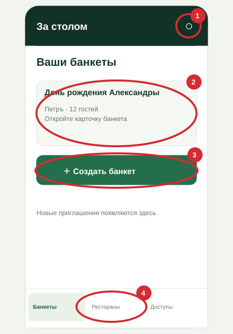
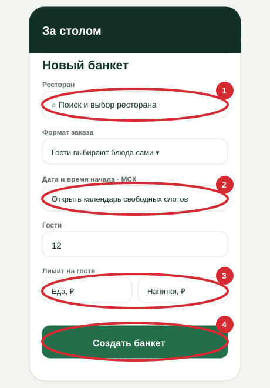
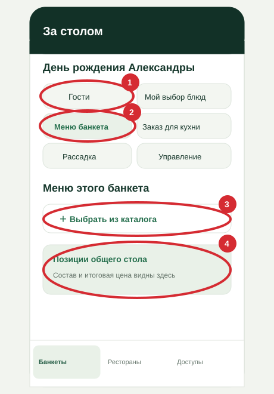
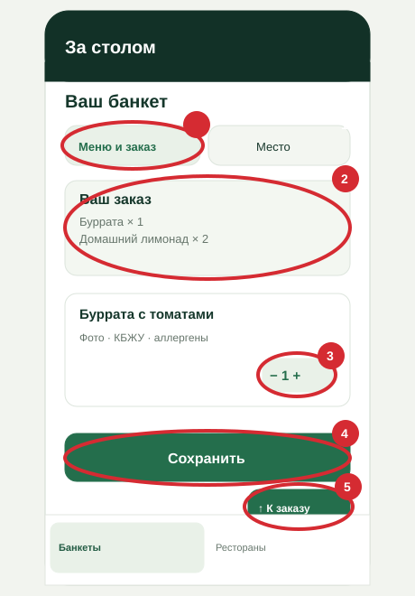

# Как пользоваться интерфейсом «За столом»

Это пошаговая инструкция для мобильной Mini App в MAX. Схемы ниже показывают расположение действий; **красные овалы и цифры** отмечают, куда нажимать. Фактический набор вкладок зависит от ваших прав и состояния банкета. Время в интерфейсе указывается по Москве (МСК).

## 1. Открыть сервис и найти банкет

Откройте бота в MAX и перейдите в Mini App. На главной странице видны доступные вам банкеты. Если вас пригласили по номеру телефона, один раз нажмите **«Подтвердить номер MAX»**; после подтверждения приглашения на этот номер будут находиться автоматически. Можно также открыть персональную ссылку от организатора.

1. Откройте **профиль** в правом верхнем углу, чтобы проверить данные и настроить категории уведомлений. Поставьте галочки слева от нужных событий и сохраните настройки.
2. Нажмите карточку **существующего банкета**. Если карточек много, используйте фильтры «Все», «В подготовке» и «Утверждены».
3. Для нового мероприятия нажмите **«Создать банкет»**.
4. Через нижнюю вкладку **«Рестораны»** посмотрите заведения, найдите нужное по названию или адресу и добавьте в избранное. Просмотр ресторанов доступен и без административных прав.

## 2. Создать банкет

Нажмите **«Создать банкет»** на главной странице. Заполните название мероприятия. Фото обложки необязательно: при выборе можно обрезать его, заменить или удалить из формы. Поддерживаются JPEG, PNG и WebP до 10 МБ.

1. В блоке **«Ресторан»** введите название или адрес. Поиск лишь фильтрует список: нажмите на подходящую строку, чтобы выбрать ресторан. При необходимости включите «Избранные». Затем укажите формат заказа — самостоятельный выбор блюд гостями или фиксированный пакет — и зал.
2. Выберите **длительность** из списка от 1 до 12 часов и **начало** в мини-календаре свободных слотов. Выбрать дату отдельной строкой не нужно. Недоступные часы и пересечения с другой бронью исключаются. Поле **«Собрать выбор до · МСК»** можно заполнить вручную или через календарь.
3. Укажите **количество гостей**. Для самостоятельного выбора блюд задайте при необходимости два независимых лимита на гостя: еда и напитки. Ноль означает отсутствие лимита. Гость видит оставшийся лимит в значках пирога 🥧 и бутылочки 🍾; позиции общего стола в личный лимит гостя не входят.
4. Выберите режим рассадки и нажмите **«Создать банкет»**. Если ресторан закрепил готовую схему столов и стульев, их расположение изменить нельзя: организатор может дать гостям выбор мест, назначить места сам или отключить рассадку. Если ресторан разрешил свободную схему, столы можно расставить позже во вкладке «Рассадка» из набора, заданного рестораном.

Если в календаре нет подходящего слота, проверьте зал, длительность и окна бронирования ресторана. Сообщение об ошибке появляется внизу экрана и не раскрывает сведения о другом мероприятии.

## 3. Организовать банкет

Создатель банкета автоматически получает права организатора именно этого мероприятия. Откройте его карточку. Организатор управляет гостями, меню банкета, рассадкой и параметрами своего банкета, но не редактирует каталог ресторана.

1. Во вкладке **«Гости»** посмотрите статусы выбора и места. Ниже списка введите имя и телефон нового гостя и нажмите **«Добавить гостя»**. Номер будет связан с гостем после его подтверждения в MAX. Права второго организатора на этот банкет выдаются в разделе «Доступы» по номеру телефона или MAX ID.
2. Откройте **«Меню банкета»**. Нажмите **«Выбрать из каталога»** и отметьте блюда ресторана, которые нужны именно этому банкету.
3. У каждого блюда включите **«Гостям на выбор»**, если гости могут заказать его себе. Если добавляете порции **«На общий стол»**, эти блюда не предлагаются гостям для личного выбора.
4. В блоке **«Позиции общего стола»** проверьте названия блюд, количества и общую цену, затем нажмите **«Сохранить позиции общего стола»**.

Во вкладке **«Мой выбор блюд»** организатор может оформить собственный заказ как гость. Во вкладке **«Рассадка»** он выбирает разрешённый режим и, если требуется, назначает места. **«Заказ для кухни»** показывает итоговые количества и пожелания. Во вкладке **«Управление»** меняются параметры мероприятия и обложка. После утверждения банкета удалить его может только администратор ресторана; до утверждения — организатор или администратор ресторана.

## 4. Выбрать блюда и место гостю

Откройте приглашение или карточку банкета. При самостоятельном выборе перейдите во вкладку **«Меню и заказ»**. При фиксированном пакете откройте **«Состав пакета»**: блюда уже заданы, выбирать их заново нельзя, но место остаётся доступным, если включена рассадка.

1. Просмотрите **меню**: категории и фильтры помогают найти блюда. На карточке указаны фото, состав, КБЖУ и аллергены. Значки 🥧 и 🍾 показывают отдельные лимиты на еду и напитки и помогают понять, сколько ещё можно выбрать.
2. Вверху страницы находится **«Ваш заказ»** — список выбранных блюд и напитков с количеством. Здесь же напишите пожелания для кухни, например об аллергии.
3. Кнопками **«+» и «−»** у блюда установите нужное количество. Вернитесь к карточке заказа: список и итог обновляются.
4. Нажмите **«Сохранить»**. Если видите «Есть несохранённые изменения», сохраните заказ ещё раз после правок.
5. При длинном меню нажмите плавающую кнопку **«К заказу»** справа. Кнопка **«Наверх»** также находится справа и ведёт к началу страницы.

Чтобы выбрать стул, откройте вкладку **«Место»** и нажмите свободное место на схеме. Для возврата к блюдам просто нажмите **«Меню и заказ»**: закрывать Mini App не требуется. Если ресторан или организатор отключил рассадку, вкладка «Место» не показывается.

## 5. Настроить ресторан и подготовить кухню

Администратор ресторана открывает нижнюю вкладку **«Рестораны»**, выбирает своё заведение и настраивает каталог блюд, пакетные предложения и залы. В настройках зала укажите вместимость, дни и часы, когда возможна бронь, а также допустимую рассадку. Для круглосуточной работы можно задать окно **00:00–23:59** на каждый день недели. Ресторан может закрепить готовую карту столов и стульев или разрешить организатору собрать схему из заданных размеров столов. Изменения настроек зала действуют для новых банкетов; существующие брони нужно менять отдельно.

В нижней вкладке **«Кухня»** выберите один или несколько банкетов и выгрузите заказ. В выгрузке есть блюда, количества, пожелания и рассадка. Разделы «Рестораны» для редактирования и «Кухня» доступны администратору ресторана и роли выше; организатор и гость могут просматривать каталог ресторанов без административного редактирования.

В нижней вкладке **«Доступы»** администратор сервиса назначает администраторов ресторанов, а организатор и администратор ресторана выдают права на конкретный банкет в пределах своих полномочий. Для добавления человека укажите его телефон или MAX ID. Список не раскрывает всех пользователей сервиса: там видны только люди, уже связанные с доступными вам ресторанами или банкетами.

## Если что-то не получается

- **Нет приглашения:** подтвердите телефон через MAX или откройте персональную ссылку. Организатору стоит проверить телефон в списке гостей.
- **Не удаётся выбрать время:** проверьте свободный слот в календаре, длительность, зал и часы бронирования. Занятые интервалы не показывают названия чужих банкетов.
- **Неактивна кнопка блюда или сохранения:** проверьте статус банкета, срок сбора выбора и личный лимит. При фиксированном пакете блюда заранее выбраны организатором.
- **Не видно нужного раздела:** вкладки зависят от роли. Для прав организатора обратитесь к организатору этого банкета или администратору ресторана.

Иллюстрации в этой инструкции — схематичные ориентиры по текущему интерфейсу; подписи и порядок действий следует обновлять вместе с изменениями Mini App.
