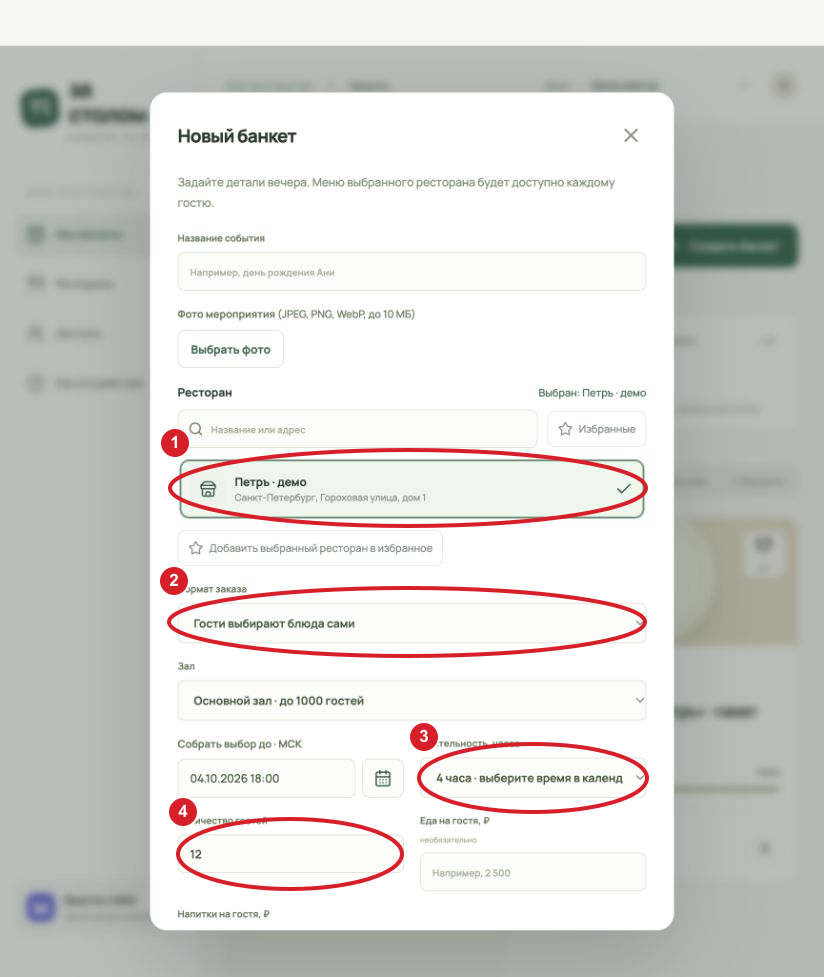
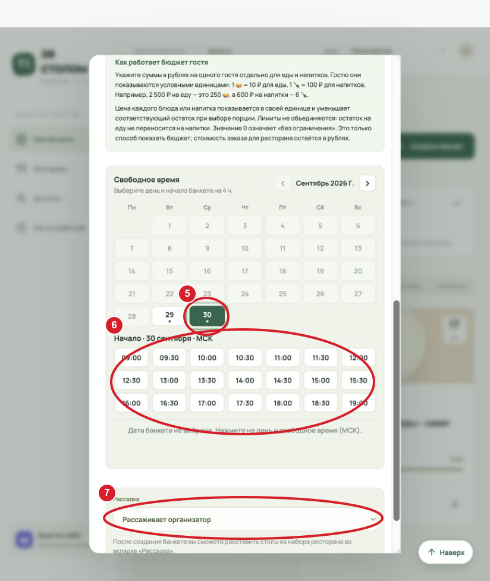
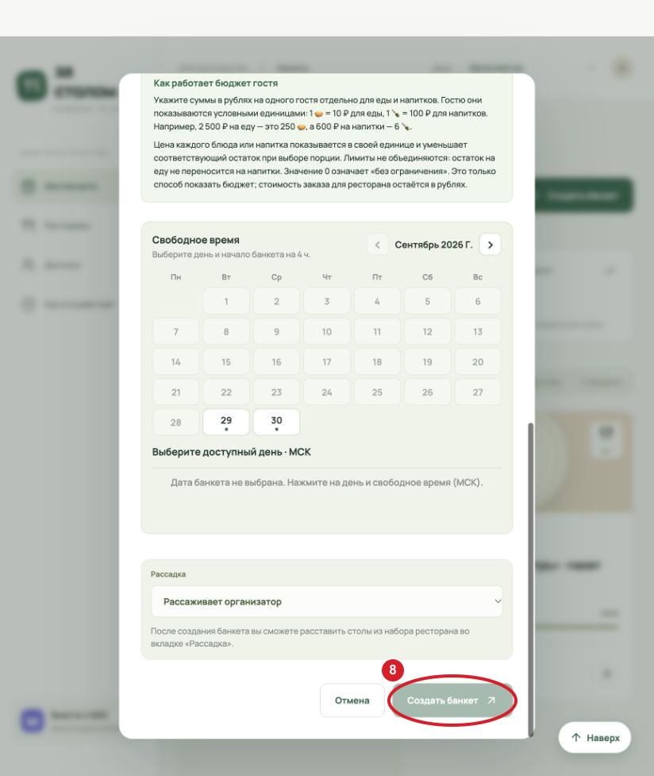
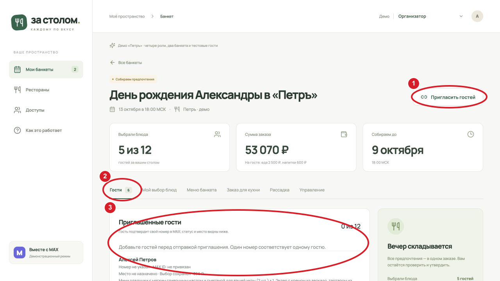
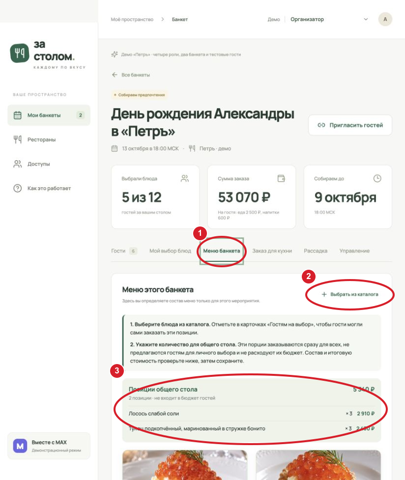
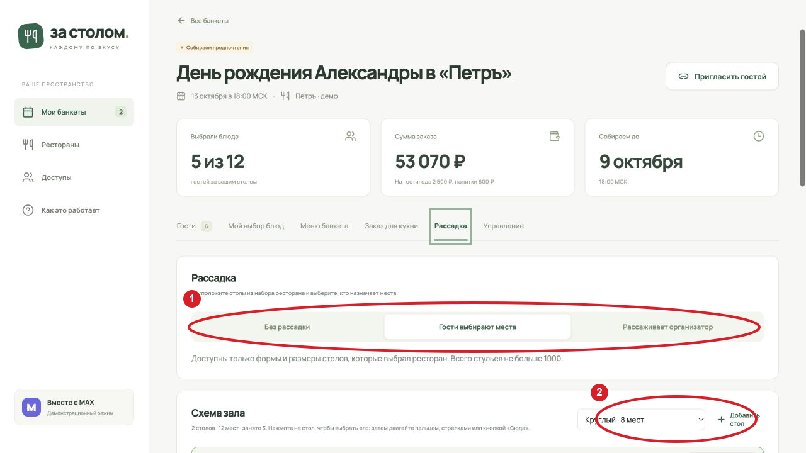
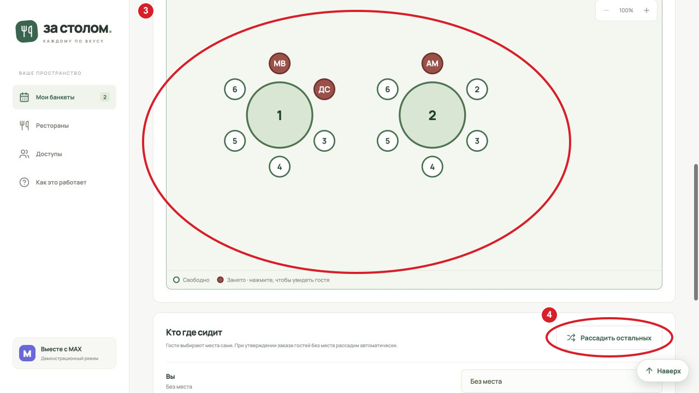
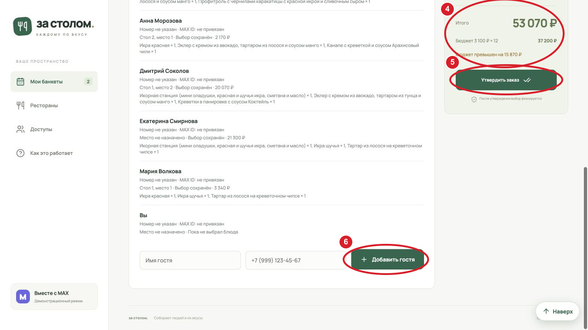
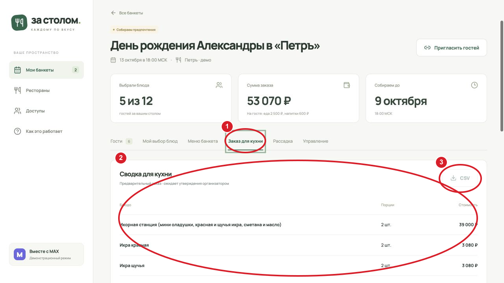
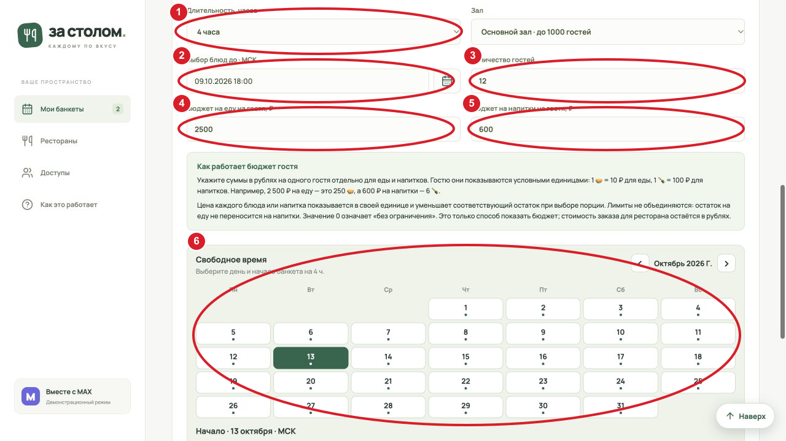

# Руководство организатора банкета

Это маршрут от выбора ресторана до готового заказа для кухни. Названия кнопок и снимки соответствуют [действующей демоверсии](https://mail.lonelycraft.ru/banquet/) на 29 сентября 2026 года. На снимках показана широкая раскладка; в MAX на телефоне основные разделы находятся внизу. Красными овалами отмечены элементы настоящих снимков демоверсии.

## С чего начать

Откройте Mini App через бота MAX или выберите **«Попробовать демо»** на стартовой странице. В демоверсии роль меняется переключателем наверху. В обычном режиме вы автоматически становитесь организатором **того банкета, который создали**. Если вас назначили вторым организатором, откройте доступный банкет из **«Мои банкеты»**. Доступ к другим ресторанам у вас только для просмотра каталога и условий залов.

Для нового события приготовьте название, число гостей, желаемые дату и время, примерный бюджет и решение о рассадке. Если гости будут выбирать блюда сами, предусмотрите время на ответы до мероприятия. Если нужен одинаковый состав для всех, используйте фиксированный пакет.

## 1. Выбрать ресторан и создать банкет

На странице **«Мои банкеты»** нажмите **«Создать банкет»**. В блоке **«Ресторан»** введите часть названия или адреса: список ниже отфильтруется. Нажмите строку ресторана для выбора; клавиша Enter в поиске не создаёт банкет. Кнопка **«Избранные»** оставляет в списке отмеченные вами заведения.

Заполните форму в таком порядке:

1. **Название события** и, по желанию, фото обложки. Фото JPEG, PNG или WebP до 10 МБ можно обрезать перед загрузкой, позже заменить или удалить.
2. **Ресторан** (овал 1), **формат заказа** (2) и **зал**. Формат **«Гости выбирают блюда сами»** открывает им меню. Формат **«Фиксированный пакет на гостя»** даёт каждому состав выбранного пакетного предложения; при наличии вариантов горячего выберите одно блюдо для всех. При этом гость по-прежнему может выбрать место, если разрешена рассадка.
3. **Собрать выбор до · МСК** — срок, после которого гость не сможет изменить заказ. Поле принимает ввод `ДД.ММ.ГГГГ ЧЧ:ММ`; кнопку календаря рядом можно использовать вместо ручного ввода. Срок должен наступить раньше банкета.
4. **Длительность** (3) — от 1 до 12 часов, с учётом времени работы зала. **Количество гостей** (4) — без ведущего нуля; не больше вместимости выбранного зала.
5. При самостоятельном выборе задайте **еду и напитки на одного гостя** в рублях. Это два независимых лимита. Например, 2 500 ₽ на еду отображаются гостю как 250 🥧, а 600 ₽ на напитки — как 6 🍾. Ноль означает отсутствие лимита. Позиции общего стола в личный лимит не входят.
6. В блоке **«Свободное время»** нажмите день (5), а затем один из доступных часов начала (6). Мини-календарь учитывает длительность, график зала и уже занятые интервалы; название чужого банкета вам не показывается. Если подходящих часов нет, попробуйте другой день, длительность или зал.
7. Выберите **рассадку** (7) и нажмите **«Создать банкет»** (8). Банкет появится в **«Мои банкеты»** со статусом **«Собираем предпочтения»**.

## 2. Пригласить людей и следить за ответами

Откройте карточку банкета. Наверху видны дата, число ответивших, сумма заказа и срок выбора. Нажмите **«Пригласить гостей»** (1), чтобы отправить ссылку через MAX или скопировать её для передачи приглашённым. Во вкладке **«Гости»** (2) добавляйте людей по имени и телефону через поля под списком; после ввода нажмите **«Добавить гостя»**. Один номер соответствует одному гостю.

В списке (3) для каждого человека видны состояние входа, сохранённый выбор, сумма и место. В обычном режиме гость подтверждает свой номер через MAX; после этого приглашение, созданное на этот номер, находится автоматически. Можно также отправить персональную ссылку. Наличие ссылки само по себе не открывает чужие ответы и права организатора.

Если помогать с подготовкой будет ещё один человек, откройте **«Доступы»** и назначьте его организатором **конкретного банкета** по номеру или MAX ID. Это не выдаёт ему право редактировать ресторан. В разделе доступов показываются только люди, связанные с доступными вам банкетами или ресторанами.

## 3. Подготовить меню банкета

Откройте **«Меню банкета»** (1), затем **«Выбрать из каталога»** (2). Добавьте позиции выбранного ресторана, которые будут доступны на этом мероприятии. У банкета свой снимок меню и цен; последующие изменения цены в каталоге не меняют заказ. Исправленное фото блюда обновится и здесь, если ресторан не назначал для этого банкета отдельное фото.

У каждой добавленной карточки есть два разных решения:

- **«Гостям на выбор»** — гость видит блюдо в своём меню и может заказать себе порции.
- **«На общий стол»** — вы указываете количество порций для всех. Эти порции сразу входят в общую стоимость и **не предлагаются гостям** для личного выбора. Они не уменьшают лимиты гостей.

В блоке **«Позиции общего стола»** (3) сверьте названия, количество и итоговую цену. После изменения количества нажмите **«Сохранить позиции общего стола»**. Уже выбранное гостем блюдо нельзя убрать из меню так, чтобы его сохранённый заказ незаметно изменился.

При фиксированном пакете состав уже задан выбранным предложением ресторана. Организатор видит пакет и итоговую стоимость, но не редактирует блюда каталога «Только для пакетов» — это зона администратора ресторана.

## 4. Настроить рассадку

Во вкладке **«Рассадка»** (1) выберите один из режимов: **«Без рассадки»**, **«Гости выбирают места»** или **«Рассаживает организатор»**. Если выбран второй вариант, гость видит свободные стулья во вкладке **«Место»**. В третьем варианте назначьте место каждому человеку сами. Кнопка **«Рассадить остальных»** (4) распределяет тех, кто ещё без места.

В режиме свободной схемы можно добавить стол разрешённого рестораном размера (2), выбрать его на плане (3), передвинуть и сохранить схему. Если ресторан закрепил **фиксированную** расстановку, расположение и набор столов менять нельзя. Тогда выбирайте только способ распределения людей по готовым стульям или режим без рассадки. При утверждении заказа оставшиеся без места гости могут быть рассажены автоматически.

## 5. Проверить итог и утвердить заказ

Вкладка **«Гости»** показывает, кто сохранил выбор и кто ещё ожидается. В блоке итогов (4) сверьте число ответивших, общую сумму и запланированный бюджет. Предупреждение о превышении планового бюджета не блокирует утверждение; проверьте состав вручную. Во вкладке **«Заказ для кухни»** (1) видны блюда, количества и стоимость; до утверждения это предварительная сводка, поэтому выгрузка CSV (3) ещё недоступна.

Когда выбор собран, нажмите **«Утвердить заказ»** (5). Для самостоятельного выбора нужен хотя бы один сохранённый ответ; для пакетного заказа достаточно выбранного пакета и числа гостей. Окно подтверждения ещё раз покажет сумму и предупредит о неответивших. После подтверждения выбор блюд и стоимость фиксируются. Если кто-то изменил заказ между вашим просмотром и нажатием, обновите банкет, проверьте новый итог и подтвердите актуальную версию. После утверждения скачайте CSV из карточки банкета. Администратор ресторана также увидит утверждённый заказ во вкладке **«Кухня»** и сможет выгрузить CSV или Excel.

## 6. Изменить параметры или удалить банкет

Откройте **«Управление»**. Здесь можно изменить название, обложку, зал, длительность (1), срок выбора (2), количество гостей (3) и бюджет еды (4) и напитков (5). Для переноса времени используйте календарь свободных слотов (6): он показывает бронь с учётом нового интервала. Сначала проверьте новые параметры, затем нажмите **«Сохранить»**. Если слот уже занят или новые параметры зала противоречат существующей брони, выберите другой вариант; чужое мероприятие в ошибке не называется.

До утверждения организатор может удалить свой банкет из раздела управления. После утверждения удалить его может только администратор ресторана. Удаление требует подтверждения и убирает доступ к заказу, поэтому перед этим сохраните нужную выгрузку.

## Если действие не удаётся

| Ситуация | Что проверить |
| --- | --- |
| Нет свободного времени | Совместимы ли выбранная длительность, зал, день и график бронирования. Попробуйте соседний день или меньшую длительность. |
| Приглашённый не видит банкет | Верно ли введён номер; подтвердил ли гость этот номер в MAX; открывал ли персональную ссылку. |
| Гость не может сохранить выбор | Не прошёл ли срок выбора; не утверждён ли заказ; хватает ли лимита на нужную позицию. |
| Нельзя изменить или убрать блюдо | Посмотрите, не заказал ли его уже гость и нет ли порций на общем столе. |
| Кнопка утверждения недоступна | При самостоятельном формате нужен минимум один сохранённый ответ гостя. |
| Не скачивается CSV | Сначала утвердите заказ. В MAX скачивание запускается через Mini App; файл ищите в загрузках MAX. |

Уведомления о новых гостях, выборе блюд и изменениях банкета можно включить по категориям в **профиле**. Чтобы сообщения приходили через бота MAX, откройте с ним личный чат и нажмите **«Начать»**. Демо показывает интерфейс, но нативное подтверждение номера и доставку сообщений проверяйте в настоящем MAX.
